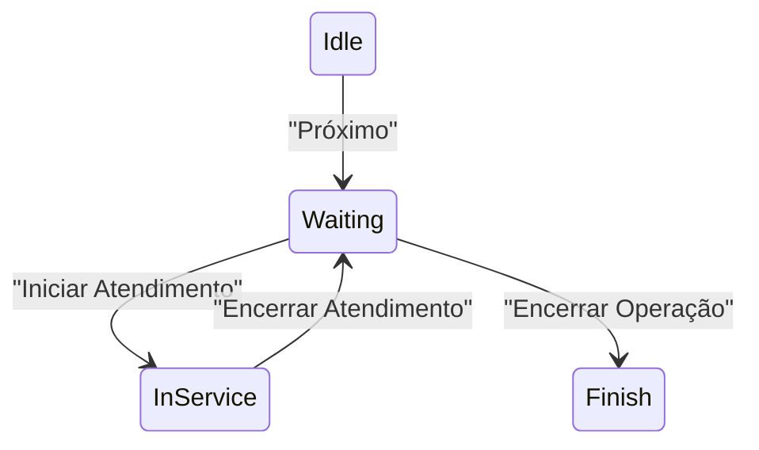

# Front‑End Architecture – Totem de Autoatendimento

> **Stack‑alvo** : React 18 + Vite + TypeScript + Tailwind CSS + Zustand (estado leve) + React Query (dados assíncronos) + WebSocket nativo
>
> **Objetivo** : código limpo, reusável e pronto para escalar para múltiplos totens/operadores.

---

## 1 · Estrutura de Pastas (monorepo ‑ /apps)

```
totem/
 ├─ apps/
 │   ├─ totem-kiosk/            # interface do cliente
 │   └─ operator-panel/         # painel do operador
 ├─ packages/
 │   ├─ ui/                     # biblioteca compartilhada de componentes
 │   ├─ hooks/                  # hooks reusáveis (zustand, query)
 │   └─ utils/                  # helpers (format-date, validators)
 ├─ docs/                       # ADRs + diagramas Mermaid
 ├─ .github/                    # CI pipelines
 └─ pnpm-workspace.yaml         # workspace TS monorepo
```

*Usamos **pnpm workspaces** para vincular pacotes locais sem publish.*

---

## 2 · Fluxo de Build

| Fase    | Ferramenta                  | Saída                              |
| ------- | --------------------------- | ---------------------------------- |
| `dev`   | Vite + Tailwind JIT         | Hot‑reload  <100 ms                |
| `test`  | Vitest + jsdom & Playwright | cobertura ≥70 %                    |
| `lint`  | ESLint, Prettier, Stylelint | zero warnings no `main`            |
| `build` | Vite + `vite-plugin-pwa`    | `dist/` PWA pronto, bundle ≤150 KB |
| `ci`    | GitHub Actions              | Docker multi‑arch                  |

---

## 3 · Padrões de Componentes (Atomic Design)

| Camada        | Pasta                            | Exemplo                                 |
| ------------- | -------------------------------- | --------------------------------------- |
| **Atoms**     | `ui/atoms/`                      | `Button.tsx`, `Icon.tsx`, `Spinner.tsx` |
| **Molecules** | `ui/molecules/`                  | `ServiceCard.tsx`, `InputCPF.tsx`       |
| **Organisms** | `ui/organisms/`                  | `PaymentModal.tsx`, `TicketPrinter.tsx` |
| **Templates** | `totem‑kiosk/pages/*`            | `SelectService.tsx`                     |
| **Pages**     | Next‑style routes (React‑Router) | `/`, `/pay`, `/error`                   |

> **CSS** : só Tailwind (@apply em componentes maiores). Para tokens de tema (cores por serviço) usamos `tailwind.config.cjs → theme.extend.colors.service[slug]`.

---

### 3.1 Exemplo – Atom Button

```tsx
export type ButtonProps = React.ButtonHTMLAttributes<HTMLButtonElement> & {
  variant?: "primary" | "secondary" | "danger";
  size?: "sm" | "md" | "lg";
};

export const Button: React.FC<ButtonProps> = ({
  variant = "primary",
  size = "md",
  className,
  ...props
}) => (
  <button
    {...props}
    className={cn(
      "rounded-2xl font-semibold transition active:scale-[.97]",
      variant === "primary" &&
        "bg-emerald-600 text-white hover:bg-emerald-700",
      variant === "secondary" &&
        "bg-white border border-emerald-600 text-emerald-600",
      size === "lg" && "px-8 py-4 text-xl",
      className
    )}
  />
);
```

`cn` é utilitário de concatenação de classes em `utils/clsx.ts`.

---

## 4 · Estado & Dados

* **Zustand** → estado local pequeno (serviço selecionado, step wizard).

  ```ts
  export const useOrder = create<OrderState>()((set) => ({
    service: null,
    setService: (s) => set({ service: s }),
  }));
  ```
* **React Query** → fetch + cache de `/tickets`, `/payments`.

  ```ts
  const postTicket = async (body: TicketInput) => fetch("/api/tickets",{…})
  export const useCreateTicket = () => useMutation(postTicket);
  ```
* **WebSocket** no pacote `hooks/` (`useSocket`) com reconexão exponencial.

---

## 5 · Rotas (React Router v6)

| Rota        | Componente          | Proteção                  |
| ----------- | ------------------- | ------------------------- |
| `/`         | `SelectService`     | pública                   |
| `/pay`      | `PaymentQR`         | exige `service` no estado |
| `/error`    | `PaymentError`      | pública                   |
| `/operator` | `OperatorDashboard` | JWT operador              |

---

## 6 · Integração com Impressora ESC/POS

* Pacote `utils/escpos.ts` (usa WebUSB + TextEncoder).
* Função `printTicket(ticket: { number: string; service: string })`.
* Graceful fallback : se `navigator.usb` indefinido → gera PDF (jsPDF) e abre `window.print()`.

---

## 7 · Acessibilidade & UX

* Fonte mínima `text-lg` (16 px).
* Contraste AA (Tailwind `text-gray-900` vs `bg-white`).
* Botões ≥48 px altura.
* Feedback áudio – `<audio src="/sounds/beep.mp3" preload="auto" />` controlado pelo operador.

---

## 8 · Testes

| Tipo      | Ferramenta      | Scope                        |
| --------- | --------------- | ---------------------------- |
| Unit      | Vitest          | átomos, hooks                |
| Component | Testing Library | moléculas/organisms          |
| E2E       | Playwright      | Seleção → Pagamento → Ticket |

CI falha se cobertura <70 % ou Playwright não passar.

---

## 9 · Performance Budget

* **Bundle JS** ≤150 KB gzip.
* **TTI** ≤2 s em tablet 3G.
* **WS reconnect** <1 s.
* Budget monitorado pelo Lighthouse CI no pipeline.

---

## 10 · Reusable / Shared Code

| Pacote  | O que expõe                                                 |
| ------- | ----------------------------------------------------------- |
| `ui`    | Button, Card, Modal, Spinner, InputCPF, TagService          |
| `hooks` | `useOrder`, `useSocket`, `usePrinter`, React Query wrappers |
| `utils` | `clsx`, `formatTicketNumber`, `maskCpf`, `logger`           |

Todos publicados localmente via **pnpm link‑workspaces** (sem NPM externo).

---

## 11 · Deploy Frontend (Vercel)

* Cada push em `main` → Vercel Production.
* Branches → Vercel Preview (link no PR).
* Headers : `Content-Security-Policy`, `X-Frame-Options` DENY.

---

## 12 · Checklist de PR

* [ ] Lint & Tests verdes
* [ ] Bundle <150 KB (Lighthouse CI)
* [ ] Storybook atualizado (caso UI nova)
* [ ] Atualizou CHANGELOG.md
* [ ] ADR criado se decisão arquit.

> **Próximo passo** : rodar `pnpm create vite` no `apps/totem-kiosk`, colar `Button` acima, ajustar Tailwind e abrir PR “feat: scaffold totem-kiosk”.

## 13 · Operator Panel / Painel de Chamada

> Interface usada pelo operador/atendente em tablet ou TV. Deve funcionar 100 % por WebSocket, mas com *polling* de fallback.

### 13.1 Estrutura de Tela (Layout Grid)

| Área               | Componente        | Descrição                                                                                                   |
| ------------------ | ----------------- | ----------------------------------------------------------------------------------------------------------- |
| **Header**         | `<ShiftStatus>`   | Mostra nome do operador logado, hora atual, nº de equipamentos ativos, botão **Encerrar Operação**.         |
| **Current Ticket** | `<CurrentTicket>` | Exibe em fonte **6rem** o número chamado (ex.: *A‑007*), serviço (cor) e temporizador regressivo (10 min).  |
| **Queue Table**    | `<QueueTable>`    | Lista próximos 10 tickets (número + serviço + tempo de fila). Scroll infinito para auditoria.               |
| **Controls**       | `<ActionBar>`     | Botões **Iniciar Atendimento / Encerrar Atendimento / Próximo**; beep toggle; seletor de equipamento (1‑3). |
| **KPIs**           | `<MiniDashboard>` | Sparkline de espera média, tickets/hora, faturamento (R\$). Atualiza a cada 30 s.                           |

### 13.2 Componentes Reutilizáveis

| Componente      | Pasta           | Props principais                       |
| --------------- | --------------- | -------------------------------------- |
| `CurrentTicket` | `ui/organisms/` | `ticket: {number, service, startedAt}` |
| `QueueTable`    | `ui/molecules/` | `tickets: Ticket[]`                    |
| `ShiftStatus`   | `ui/atoms/`     | `operatorName`, `equipmentActive`      |
| `ActionBar`     | `ui/molecules/` | callbacks `onStart`, `onEnd`, `onNext` |
| `EndShiftModal` | `ui/organisms/` | `onConfirm` (gera CSV)                 |

### 13.3 Estado & Fluxos



* Zustand store `useShift` mantém `current`, `queue`, `status`, `equipmentCount`.
* React Query `useQueue()` faz `GET /tickets?status=pending&limit=20` no fallback.

### 13.4 Encerrar Operação → Relatório

1. Operador clica **Encerrar** → `<EndShiftModal>` confirma.
2. Front chama `POST /operator/close` → backend gera CSV (tickets atendidos, tempo médio, faturamento) e retorna URL.
3. Modal exibe botão **Download CSV** (`<a href={url} download>`).
4. Store `reset()` e navega a `/operator/login`.

### 13.5 Acessibilidade & UX específicas

* **Fonte enorme** (min 96 px) para *CurrentTicket* em TV a 3 m.
* Beep padrão `440 Hz` 300 ms; volume slider salva em `localStorage`.
* Cores por serviço carregadas de `/services` → se cor `#ffffff`, aplica borda escura p/ contraste AA.

### 13.6 Testes obrigatórios

* Playwright `operator.spec.ts` → fluxo completo com WebSocket mock.
* Vitest snapshot de `QueueTable` com 10 itens.
* Axe-core no CI com regra WCAG AA para contraste.

### 13.7 Performance target

* Render inicial `<200 ms` em tablet Chromebook.
* WS fallback polling 3 s; p95 de diff chamada < 500 ms.

---
O guia já cobre 80 % do que um “copilot” (Cursor, Copilot, Codeium…) precisa para gerar código — estrutura de pastas, convenções de nome, padrões de estado, testes e perf budget.
Mas, para evitar tropeços típicos, recomendo adicionar quatro blocos curtos:

| Bloco extra               | Por que ajuda o IA-pair-programmer                             | O que colocar (bem direto)                                                                                             |
| ------------------------- | -------------------------------------------------------------- | ---------------------------------------------------------------------------------------------------------------------- |
| **Contratos de API**      | Gera tipagens automáticas, evita “adivinha” a shape dos dados. | • `openapi.yaml` só com `/tickets`, `/payments`, `/queue`.<br>• Script `pnpm gen-sdk` (oai-typings ou zodios).         |
| **Design Tokens**         | Mantém cores/tamanhos iguais nos dois apps sem re-escrever.    | `packages/ui/tokens.ts` com: `primary`, `accent`, `serviceColors`.<br>Tailwind extende via `plugin(({addBase}) => …)`. |
| **Variáveis de ambiente** | Cursor pede exemplos quando faz fetch/env.                     | `.env.example`:<br>`VITE_API_URL=`<br>`VITE_WS_URL=`<br>`VITE_SENTRY_DSN=`                                             |
| **Storybook** (ou Ladle)  | IA sugere props/doc se as stories existem.                     | • `packages/ui/.storybook/main.ts` pronto.<br>• Story “HappyPath” para `CurrentTicket`, `QueueTable`.                  |

<details><summary>Checklist rápido para dizer “pronto”</summary>

* [ ] `docs/openapi.yaml` commitado
* [ ] Script `gen-sdk` gera hooks React Query (`/packages/api`)
* [ ] `tokens.ts` exporta cores + spacings
* [ ] `.env.example` alinhado com backend
* [ ] Storybook roda: `pnpm storybook`

</details>

Se esses quatro itens estiverem no repo, o Cursor conseguirá:

* **Autocomplete** de chamadas (`useCreateTicketMutation`) com tipos corretos.
* Sugerir a cor do serviço certo (`serviceColors[service.slug]`).
* Gerar fetches já apontando para `import.meta.env.VITE_API_URL`.
* Exibir componentes em Storybook e gerar testes de snapshot.

Em suma:
*✅ Documento atual = suficiente para começar.*
*➕ Com os quatro blocos acima = “não precisa perguntar nada” enquanto gera o front.*
