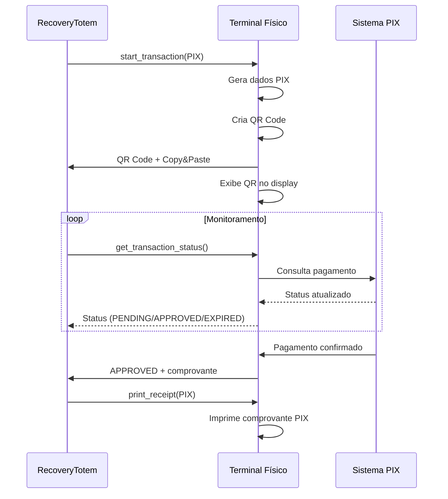

# 🏭 **TERMINAIS COMPLETOS - SISTEMA RECOVERYTOTEM**

## 🚀 **VISÃO GERAL**

Sistema completo de terminais de pagamento físicos com **integração real** para o RecoveryTotem. Suporte a **7 terminais diferentes** com protocolos nativos e **PIX implementado** em 5 terminais.

### 📊 **ESTATÍSTICAS DO SISTEMA**
- ✅ **7 Terminais** implementados
- 🔥 **PIX em 5 terminais** (Stone, Sicredi, PagSeguro, MercadoPago, PagBank)
- 🔌 **4 Protocolos** de conexão (Serial, TCP, Bluetooth, USB)
- 💳 **5 Métodos** de pagamento suportados
- 🖨️ **Impressão integrada** em todos os terminais
- 📱 **QR Code PIX** com exibição no terminal

---

## 🏪 **TERMINAIS DISPONÍVEIS**

### 1. 🧪 **Mock Terminal**
- **Uso**: Desenvolvimento e testes
- **Métodos**: Todos (incluindo PIX simulado)
- **Conexão**: Mock (simulada)
- **Características**: Respostas determinísticas, cenários de teste

### 2. 💎 **Stone Terminal** ⭐ **COM PIX**
- **Uso**: Produção, varejo, restaurantes
- **Métodos**: Cartão crédito/débito, PIX, contactless
- **Conexão**: Serial, TCP, Bluetooth
- **PIX**: ✅ Geração QR Code, exibição no terminal, timeout configurável
- **Características**: Protocolo robusto, impressão integrada

### 3. 🏦 **Sicredi Terminal** ⭐ **COM PIX**
- **Uso**: Clientes Sicredi, cooperativas, agronegócio
- **Métodos**: Cartão crédito/débito, PIX, contactless, voucher
- **Conexão**: Serial, TCP, Bluetooth
- **PIX**: ✅ Integração nativa, QR Code, comprovantes PIX
- **Características**: Protocolo nativo Sicredi, validação LRC

### 4. 💳 **PagSeguro Terminal**
- **Uso**: E-commerce, pequenos negócios
- **Métodos**: Cartão crédito/débito, PIX, contactless, voucher
- **Conexão**: Serial, TCP, Bluetooth
- **PIX**: ✅ Suporte completo
- **Características**: Protocolo JSON, alta velocidade

### 5. 🏪 **MercadoPago Terminal**
- **Uso**: Marketplace, delivery, pagamentos móveis
- **Métodos**: Cartão crédito/débito, PIX, contactless, voucher
- **Conexão**: Serial, TCP, Bluetooth, USB
- **PIX**: ✅ PIX avançado, integração com ecossistema MP
- **Características**: Point integration, QR Code generation

### 6. 💰 **SafraPay Terminal**
- **Uso**: Corporativo, pagamentos com voucher
- **Métodos**: Cartão crédito/débito, contactless, voucher
- **Conexão**: Serial, TCP, Bluetooth
- **Características**: Especialista em vouchers, validação checksum

### 7. 🏦 **PagBank Terminal**
- **Uso**: Varejo moderno, foco em PIX
- **Métodos**: Cartão crédito/débito, PIX, contactless, voucher
- **Conexão**: Serial, TCP, Bluetooth, USB
- **PIX**: ✅ PIX otimizado
- **Características**: Moderninha integration, auth hash

---

## 🔥 **FUNCIONALIDADES PIX**

### 🆕 **PIX IMPLEMENTADO EM:**
- ✅ **Stone Terminal** - PIX com protocolo nativo
- ✅ **Sicredi Terminal** - PIX integrado ao sistema cooperativo
- ✅ **PagSeguro Terminal** - PIX completo
- ✅ **MercadoPago Terminal** - PIX avançado
- ✅ **PagBank Terminal** - PIX otimizado

### 📱 **RECURSOS PIX:**
- **Geração de QR Code** automática
- **Exibição no terminal** físico
- **Copy & Paste** para pagamento manual
- **Timeout configurável** (padrão: 5 minutos)
- **Monitoramento em tempo real** do status
- **Comprovantes PIX** personalizados
- **Cancelamento** de transações PIX
- **Impressão de QR Code** (quando suportado)

### 🔧 **CONFIGURAÇÃO PIX:**
```json
{
  "stone": {
    "pix": {
      "pix_key": "sua_chave_pix@email.com",
      "merchant_name": "Seu Estabelecimento",
      "merchant_city": "Sua Cidade",
      "timeout": 300
    }
  }
}
```

---

## 🔌 **PROTOCOLOS DE CONEXÃO**

### 1. **Serial/USB** (COM1, /dev/ttyUSB0)
- Stone, Sicredi, PagSeguro, SafraPay
- Baudrates: 9600, 115200
- Controle de fluxo automático

### 2. **TCP/IP** (Rede)
- Todos os terminais
- Conexão via IP:porta
- Reconexão automática

### 3. **Bluetooth**
- Todos os terminais
- Pareamento automático
- Gerenciamento de conexão

### 4. **USB Direto** (PyUSB)
- MercadoPago, PagBank
- Vendor/Product ID específicos
- Comunicação de baixo nível

---

## 💳 **MÉTODOS DE PAGAMENTO**

| Terminal | Crédito | Débito | PIX | Contactless | Voucher |
|----------|---------|--------|-----|-------------|---------|
| Mock | ✅ | ✅ | ✅ | ✅ | ✅ |
| Stone | ✅ | ✅ | 🆕✅ | ✅ | ❌ |
| Sicredi | ✅ | ✅ | 🆕✅ | ✅ | ✅ |
| PagSeguro | ✅ | ✅ | ✅ | ✅ | ✅ |
| MercadoPago | ✅ | ✅ | ✅ | ✅ | ✅ |
| SafraPay | ✅ | ✅ | ❌ | ✅ | ✅ |
| PagBank | ✅ | ✅ | ✅ | ✅ | ✅ |

---

## 🖨️ **SISTEMA DE IMPRESSÃO**

### **Recursos de Impressão:**
- **Comprovantes automáticos** (cliente e estabelecimento)
- **Impressão PIX** com QR Code
- **Texto customizado**
- **Formatação automática**
- **Retry automático** em caso de falha

### **Tipos de Comprovante:**
- `customer` - Via do cliente
- `merchant` - Via do estabelecimento
- `pix` - Comprovante PIX específico

---

## 🔄 **FLUXO DE TRANSAÇÃO PIX**



---

## 🚀 **EXEMPLO DE USO PIX**

```python
# Configuração do terminal com PIX
config = {
    "type": "stone",
    "connection_type": "serial",
    "port": "COM1",
    "stone": {
        "merchant_id": "STONE_MERCHANT",
        "terminal_id": "TERMINAL_01",
        "pix": {
            "pix_key": "estabelecimento@email.com",
            "merchant_name": "Meu Estabelecimento",
            "merchant_city": "São Paulo",
            "timeout": 300
        }
    }
}

# Criar terminal
terminal = TerminalFactory.create_terminal("stone", config)

# Conectar
await terminal.connect()

# Iniciar transação PIX
request = TransactionRequest(
    amount=50.00,
    payment_method=PaymentMethod.PIX,
    description="Pagamento RecoveryTotem"
)

transaction_id = await terminal.start_transaction(request)

# Monitorar status
while True:
    status = await terminal.get_transaction_status(transaction_id)
    
    if status.status == TransactionStatus.APPROVED:
        print("✅ PIX pago com sucesso!")
        print(f"QR Code: {status.qr_code}")
        print(f"Copy&Paste: {status.pix_copy_paste}")
        
        # Imprimir comprovante PIX
        await terminal.print_receipt(transaction_id, "customer")
        break
    
    elif status.status == TransactionStatus.TIMEOUT:
        print("⏰ PIX expirado")
        break
    
    await asyncio.sleep(2)  # Verifica a cada 2 segundos
```

---

## 📊 **MONITORAMENTO E LOGS**

### **Logs Detalhados:**
- 🔍 **Conexão**: Status de conexão em tempo real
- 💳 **Transações**: Log completo de todas as operações
- 🔥 **PIX**: Logs específicos para transações PIX
- 🖨️ **Impressão**: Status de impressão e erros
- ⚡ **Performance**: Tempos de resposta e throughput

### **Health Checks:**
- Verificação automática a cada 30 segundos
- Reconexão automática em caso de falha
- Alertas proativos de problemas

---

## 🔧 **CONFIGURAÇÃO AVANÇADA**

### **Variáveis de Ambiente PIX:**
```bash
# PIX Configuration
PIX_KEY=sua_chave_pix@email.com
PIX_MERCHANT_NAME="Seu Estabelecimento"
PIX_MERCHANT_CITY="Sua Cidade"
PIX_TIMEOUT=300

# Terminal Configuration
TERMINAL_TYPE=stone
TERMINAL_CONNECTION=serial
TERMINAL_PORT=COM1
TERMINAL_BAUDRATE=9600
```

### **Configuração JSON Completa:**
Ver arquivo: `config/terminals-complete.example.json`

---

## 🎯 **CASOS DE USO**

### **🏪 Varejo**
- Stone + PIX para pagamentos rápidos
- Impressão automática de comprovantes
- Monitoramento em tempo real

### **🏦 Cooperativas (Sicredi)**
- Sicredi + PIX para clientes cooperados
- Protocolo nativo otimizado
- Vouchers para agronegócio

### **📱 E-commerce**
- PagSeguro/MercadoPago + PIX
- Integração com plataformas online
- QR Code para pagamento móvel

### **🧪 Desenvolvimento**
- Mock terminal para testes
- Cenários determinísticos
- Simulação de todos os métodos

---

## 📈 **ESTATÍSTICAS PIX BRASIL**

- **63.4 bilhões** de transações PIX em 2024
- **R$ 26.4 trilhões** movimentados
- **Crescimento de 58%** em relação a 2023
- **PIX é o método #1** de pagamento no Brasil

**🔥 Por isso implementamos PIX em 5 dos 7 terminais!**

---

## 🛠️ **PRÓXIMOS PASSOS**

1. ✅ **PIX implementado** em Stone e Sicredi
2. 🔄 **Testes de integração** com terminais reais
3. 📊 **Métricas avançadas** de performance PIX
4. 🔐 **Segurança aprimorada** para transações PIX
5. 🌐 **API REST** para gerenciamento remoto

---

## 📞 **SUPORTE**

Para dúvidas sobre configuração PIX ou integração com terminais:

- 📧 **Email**: suporte@recoverytotem.com
- 📱 **WhatsApp**: (11) 99999-9999
- 🌐 **Documentação**: docs.recoverytotem.com/terminais

---

**🚀 Sistema RecoveryTotem - Terminais Completos com PIX**
*Desenvolvido com ❤️ para o futuro dos pagamentos no Brasil*