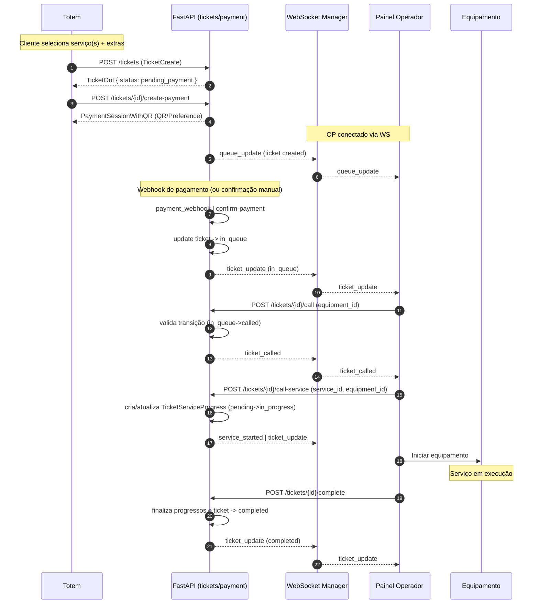

Vou incluir dois diagramas Mermaid para ilustrar: 1) máquina de estados do ticket; 2) sequência do fluxo Totem → Pagamento → Fila → Operador. Vou gerar ambos agora.
Ran tool
Ran tool
### Documento: Sistema de Tickets – visão completa (backend e frontends)

- Objetivo: mapear estados, modelos, endpoints, regras de transição, integração com pagamento, fila/atendimento por serviço, e canais em tempo real (WS) usados por Totem e Painel.

### 1) Modelo de dados principal

- Ticket (`apps/api/models.py`)
  - Campos: `id`, `tenant_id`, `payment_session_id`, `ticket_number`, `status`, `customer_name/cpf/phone`, `consent_version`, `priority`, `queue_position`, `estimated_wait_minutes`, `assigned_operator_id`, `equipment_id`, timestamps (`printed_at`, `queued_at`, `called_at`, `started_at`, `completed_at`, `cancelled_at`, `expired_at`, `reprinted_at`), `operator_notes`, `cancellation_reason`, `print_attempts`, `reactivation_count`, `payment_confirmed`.
  - Relacionamentos: `services` (`TicketService`), `extras` (`TicketExtra`), `payment_session`, `assigned_operator`, `equipment`.
- Itens associados:
  - `TicketService` (serviço por ticket) e `TicketServiceProgress` (progresso por serviço).
  - `TicketExtra` (extras por ticket).

### 2) Estados e transições

- Fonte: `apps/api/constants.py` (enums, cores, descrições, utilitários de transição).
- Estados: `pending_payment`, `paid`, `printing`, `print_error`, `in_queue`, `called`, `in_progress`, `completed`, `cancelled`, `expired`.
- Regras:
  - `pending_payment -> paid | cancelled`
  - `paid -> printing | print_error | cancelled`
  - `printing -> in_queue | print_error | cancelled`
  - `print_error -> printing | in_queue | cancelled`
  - `in_queue -> called | expired | cancelled`
  - `called -> in_progress | in_queue | expired | cancelled`
  - `in_progress -> completed | cancelled`
  - `expired -> called | cancelled`
- Utilitários:
  - `can_transition(from, to)`, `get_valid_transitions(status)`, `get_status_info(status)`, `is_final_state`.
- Priorização e fila: `QueuePriority`, `QueueSortOrder`, `QUEUE_CONFIG`, `QUEUE_TIMINGS`, `calculate_priority`, `get_waiting_time_status`.

Diagrama de estados:
```mermaid
stateDiagram-v2
    [*] --> "pending_payment"
    "pending_payment" --> "paid": "pagamento confirmado"
    "pending_payment" --> "cancelled"
    "paid" --> "printing"
    "paid" --> "print_error"
    "paid" --> "cancelled"
    "printing" --> "in_queue"
    "printing" --> "print_error"
    "printing" --> "cancelled"
    "print_error" --> "printing"
    "print_error" --> "in_queue"
    "print_error" --> "cancelled"
    "in_queue" --> "called"
    "in_queue" --> "expired"
    "in_queue" --> "cancelled"
    "called" --> "in_progress"
    "called" --> "in_queue"
    "called" --> "expired"
    "called" --> "cancelled"
    "in_progress" --> "completed"
    "in_progress" --> "cancelled"
    "expired" --> "called"
    "expired" --> "cancelled"
    "completed" --> [*]
    "cancelled" --> [*]
```

### 3) Backend – principais endpoints (tickets)

Arquivo: `apps/api/routers/tickets.py`.

- Listagem/consulta:
  - `GET /tickets/queue` → `TicketQueue` com filtros: `sort_order`, `service_id`, `priority_filter`, `include_called`, `include_in_progress`.
  - `GET /tickets/queue/public` (sem auth) por `tenant_id`.
  - `GET /tickets/queue/next`, `GET /tickets/queue/statistics`.
  - `GET /tickets/my-tickets` (operador): traz tickets atribuídos e com serviços em andamento.
  - `GET /tickets/{ticket_id}` → `TicketOut`.
- CRUD/fluxo:
  - `POST /tickets` (Totem): cria ticket em `pending_payment`, persiste `services` e `extras`, decrementa estoque de `extras`. Faz broadcast `queue_update`.
  - `PATCH /tickets/{ticket_id}/status`: valida com `can_transition`, atualiza timestamps por status, e inclui `cancellation_reason` quando aplicável. Faz broadcast.
  - Impressão/reimpressão: `POST /tickets/{id}/reprint`.
  - Movimento para fila: `POST /tickets/{id}/move-to-queue`.
  - Cancelamento: `POST /tickets/{id}/cancel`.
  - Conclusão: `POST /tickets/{id}/complete` (encerra progressos, libera equipamentos, ajusta ticket).
- Chamar/atender:
  - `POST /tickets/{id}/call` (define `called`, emite `ticket_called` e `ticket_update`).
  - `POST /tickets/{id}/call-service` (por `service_id`): cria/atualiza `TicketServiceProgress` para `in_progress`, valida conflitos de equipamento e serviço.
  - `POST /tickets/{id}/call-intelligent` (com verificação opcional de conflitos de cliente/serviço).
- Saúde/consistência:
  - `POST /tickets/auto-expire` (limpa expirados).
  - `POST /tickets/emergency/cleanup-inconsistent-states` (limpeza de estados inconsistentes).
- Integrações:
  - Broadcasts via `websocket_manager` após criação e mudanças de status.
  - Usa `queue_manager`, `printer_manager` e `payment` quando aplicável.

### 4) Backend – Pagamento → criação de ticket

Arquivo: `apps/api/routers/payment_sessions.py`.

- `POST /payment-sessions`: cria sessão de pagamento (pix/mercadopago), pode gerar QR e preference id.
- `POST /payment-sessions/webhook`: ao receber `status=paid`, chama `create_ticket_from_payment_session`:
  - Gera `ticket_number`.
  - Cria `Ticket` com `IN_QUEUE` e `queued_at`.
  - Cria `TicketService` para os serviços associados (hoje 1 principal por sessão).
  - Commit e retorno.
  - Emite `payment_update` e subsequentes atualizações para fila.
- `POST /tickets/{ticket_id}/create-payment`: usado no fluxo Totem após criar o ticket direto, criando a sessão vinculada.
- Endpoints auxiliares de teste/simulação e status de impressão.

### 5) Progresso por serviço (multi-serviços por ticket)

- Modelo: `TicketServiceProgress` com `status` (`pending`, `in_progress`, `completed`, `cancelled`), `duration_minutes`, `operator_notes`, `equipment_id`, timestamps.
- Ao chamar um serviço específico (`/call-service`):
  - Verifica/instancia `TicketServiceProgress` para o `TicketService` alvo.
  - Valida se o equipamento não está ocupado e se o mesmo cliente não está em atendimento no mesmo serviço em outro ticket.
  - Atualiza para `in_progress` e emite updates via WS.
- Ao completar/cancelar ticket:
  - Atualiza todos progressos pendentes/ativos, libera `equipment_id`.
- Schemas: `apps/api/schemas/ticket_service_progress.py`.

### 6) WebSocket – atualização em tempo real

Arquivo: `apps/api/services/websocket.py`.

- Gerencia conexões por tipo: `operator`, `totem`, `display`, e geral.
- Eventos:
  - `ticket_update` (mudança de status/atualização).
  - `ticket_called` (dados para displays e operadores).
  - `queue_update` (lista/itens de fila).
  - `payment_update`, `equipment_update`, e eventos de serviço (`service_started`).
- Integração com notificações sonoras por evento (`NEW_TICKET_IN_QUEUE`, `TICKET_CALLED`, `TICKET_TIMEOUT`, `PAYMENT_COMPLETED`).
- Painel e Totem consomem via hooks específicos.

Diagrama de sequência (Totem → Pagamento → Fila → Operador):


### 7) Frontend Totem (`apps/totem-client`)

- Criação de ticket direto (multi-serviços e extras): `api.createTicket` envia `TicketCreate` para `POST /tickets`, depois cria `PaymentSession` para o ticket via `createPaymentForTicket`.
- Páginas:
  - `SelectServicePage`: múltipla seleção de serviços antes de extras.
  - `PaymentPage`: cria ticket, cria sessão de pagamento, exibe QR/Preference, usa WS para ouvir atualizações.
  - `QueuePage`: consome `GET /tickets/queue` público e WebSocket via `useQueueWebSocket` para atualizações e detecção de chamada.
  - `TicketPage`: exibe resumo do ticket e contagem regressiva.
- WebSocket hook Totem: `useQueueWebSocket`
  - Trata `ticket_update`, `ticket_status_changed`, `queue_update`.
  - Quando o ticket do cliente muda para `called`, toca som e dispara callback.

### 8) Frontend Painel (`apps/panel-client`)

- Serviços de API: `src/services/ticketService.ts`
  - `getQueue`, `getMyTickets`, `call`, `callService`, `callIntelligent`, `start`, `complete`, `cancel`, `reprint`, `confirmPayment`, `moveToQueue`, `getPendingPayment`, `emergencyCleanupInconsistentStates`.
- Hooks:
  - `useOperatorActions`: mutations para chamar ticket/serviço, confirmar pagamento, mover para fila, com invalidation de `['tickets','queue']`, `['tickets','my-tickets']`, e `['service-progress']`.
  - `useTicketQueue`/`useTicketQueueImproved`: integra WS para `queue_update`, `ticket_update`, `ticket_called`, `equipment_update`.
- Página `OperatorPage.tsx`:
  - Renderiza cards por serviço, usa `serviceProgress` para estado por serviço.
  - Regras para concluir ticket considerando progressos.
  - Integra chamadas de serviço (`callService`), iniciar (`startServiceProgress`) e completar (`completeServiceProgress`) um serviço individual.

### 9) Fluxos principais

- Totem:
  1) Seleciona serviços/extras → cria `Ticket` (`pending_payment`) → cria `PaymentSession` → aguarda webhook ou confirmação manual → ticket vai para `in_queue`.
  2) Recebe atualizações de fila via WS (posição, status, chamado).
- Painel:
  1) Vê fila (`in_queue`) e “Meus tickets” (serviços em progresso/atribuições).
  2) Chama ticket (`called`), chama serviço específico (`TicketServiceProgress` → `in_progress`), usa equipamento.
  3) Conclui ou cancela: fecha progressos e muda ticket para `completed`/`cancelled`.

### 10) Contratos essenciais (resumo)

- `POST /tickets`: body `TicketCreate` com `tenant_id`, `services[{service_id, price}]`, `customer_*`, `extras[{extra_id, quantity, price}]`, `signature` opcional. Retorna `TicketOut`.
- `PATCH /tickets/{id}/status`: body `TicketStatusUpdate` com `status` e, se `cancelled`, `cancellation_reason`.
- `POST /tickets/{id}/call`: body `{ equipment_id }`. Retorna ticket/estado atualizado e emite `ticket_called`.
- `POST /tickets/{id}/call-service`: body `{ service_id, equipment_id }`. Cria/atualiza `TicketServiceProgress` e bloqueia equipamento.
- `POST /tickets/{id}/complete`: encerra progressos e o ticket.
- `GET /tickets/queue`: parâmetros de ordenação/filtros.
- `POST /tickets/{id}/create-payment` e `POST /payment-sessions/webhook`: integram pagamento ↔ ticket.

### 11) Observações e pontos de atenção

- Início padrão no modelo `Ticket.status` é `"paid"`, mas o fluxo do Totem cria em `pending_payment` e depois transita para `in_queue` após confirmação.
- `PaymentSession` atualmente cobre um serviço principal; múltiplos serviços entram por `POST /tickets`. Se houver pagamento único para vários serviços, a divisão de preço é proporcional ao número de serviços.
- Conflitos: validações evitam equipamento ocupado e cliente atendido no mesmo serviço simultaneamente.
- WebSocket unifica eventos para Totem, Operador e Displays; hooks do front garantem cache reativo (React Query).

Se quiser, eu formato este conteúdo em um arquivo de documentação no repositório (por exemplo `docs/sistema-de-tickets.md`) com links para endpoints/arquivos. Quer que eu crie esse arquivo? 
- Posso também incluir uma seção de “checklist de testes” e “troubleshooting” (ex.: impressão falhou → `print_error` → regras para reimpressão/ir para fila).


Entendi perfeitamente: para tickets com múltiplos serviços, ao chamar um serviço específico (por exemplo, Crioterapia), apenas esse serviço deve sair da fila e entrar em atendimento; os outros serviços do mesmo cliente (por exemplo, Bota de Compressão) devem permanecer na fila até serem chamados separadamente. Hoje, a chamada está “globalizando” o ticket e todos os serviços parecem ir juntos.

Segue um plano prático e incremental para implementar o comportamento independente por serviço.

### Diagnóstico rápido (pontos prováveis do problema)
- Backend oferece dois fluxos de chamada:
  - Global do ticket: `POST /tickets/{ticket_id}/call` (tende a alterar o status do ticket como um todo).
  - Por serviço: `POST /tickets/{ticket_id}/call-service` (usa `TicketServiceProgress` para individualizar).
- Frontend do painel pode estar usando a chamada global ou derivando a exibição da fila pelo `ticket.status` global, o que “esconde” o ticket em outras filas quando um serviço entra em andamento.

Referência no painel:
```328:334:apps/panel-client/src/pages/OperatorPage.tsx
const isCalledInOtherQueues = ticket.status === 'called' || ticket.status === 'in_progress';
const isCalledForThisService = ticket.serviceProgress?.some(p => 
  (p.service_id === currentService || p.service_name === currentService) && p.status === 'in_progress'
);
```

### Mudanças recomendadas

- Backend
  - Desencorajar/limitar o uso de `POST /tickets/{id}/call` para tickets com múltiplos serviços; usar somente `POST /tickets/{id}/call-service` para chamadas por serviço. Opcional: retornar 400 quando houver mais de um serviço e a chamada for a global.
  - Garantir que `call-service` não altere o `ticket.status` de forma que impacte as outras filas. O status fonte de verdade por fila deve ser o `TicketServiceProgress` do serviço específico.
  - Enriquecer eventos WS com `service_id`:
    - Hoje há `ticket_called`. Adicionar `service_called` (ou incluir `service_id` no `ticket_called`), para que o painel atualize apenas a fila do serviço chamado.
  - Fila por serviço no endpoint:
    - Em `GET /tickets/queue`, quando filtrado por `service_id`, basear o “status na fila” no `TicketServiceProgress` daquele serviço (ex.: `pending` → elegível na fila, `in_progress` → fora da fila, `completed` → concluído). Evitar decidir pela flag global do ticket.

- Frontend (Painel)
  - Ao clicar “Chamar” em uma fila de serviço, usar sempre a mutation por serviço:
    ```50:61:apps/panel-client/src/services/ticketService.ts
const response = await api.post(`/tickets/${ticketId}/call`, { equipment_id: equipmentId }, { params: withTenant() });
```
    Trocar essa ação para a versão por serviço (já existe):
    ```65:80:apps/panel-client/src/services/ticketService.ts
const response = await api.post(`/tickets/${ticketId}/call-service`, { 
  service_id: serviceId, 
  equipment_id: equipmentId 
}, { params: withTenant() });
```
  - Na `OperatorPage`, remover a lógica que esconde o ticket em outras filas com base no `ticket.status` global. Em vez disso, decidir a exibição/ação com base no `serviceProgress` do `currentService`:
    - Exibir na fila se não há `TicketServiceProgress` “in_progress” para aquele `service_id`.
    - Botão “Chamar” deve acionar `callService(ticket.id, currentService, equipmentId)`.
  - WebSocket do painel: ao receber `ticket_called` sem `service_id`, disparar um re-fetch do `service-progress` do ticket chamado; se o backend passar `service_id`, atualizar apenas a fila correspondente sem afetar as demais.

- Frontend (Totem)
  - Sem mudanças diretas. Mantém criação do ticket com múltiplos serviços e extras. O comportamento independente acontece no painel.

- Estados agregados do ticket (opcional, fase 2)
  - Se precisar refletir melhor o estado “parcial”, considerar um status agregado como “partially_in_progress” quando pelo menos um serviço está ativo e outro ainda está na fila. Caso contrário, manter o `ticket.status` como “in_queue” e calcular agregados no backend apenas para dashboards.
  - `POST /tickets/{id}/complete` só deveria concluir o ticket quando todos os serviços estiverem `completed`. Se quiser concluir parcialmente, mover essa ação para o nível do serviço (concluir o `TicketServiceProgress` específico) e manter o ticket aberto até todos concluírem.

### Ordem sugerida de implementação (rápido → robusto)
- Quick win (sem migração de dados):
  - Trocar a ação “Chamar” no painel para usar `call-service`.
  - Ajustar a renderização das filas para basear-se em `TicketServiceProgress` do `currentService` (e não no `ticket.status`).
  - Ao receber `ticket_called`, revalidar `['service-progress']` do ticket; melhor ainda se o backend incluir `service_id`.
- Evolução (robusta):
  - WS enviar `service_called` com `ticket_id` e `service_id`.
  - `GET /tickets/queue` entregar items já “per-service” (cada item = `ticket_id` + `service_id` + `queue_status` derivado do progress).

### Testes de aceitação
- Criar ticket com serviços A e B.
- Chamar A: A deve ir para `in_progress` (ou `called`) no painel, B permanece em `in_queue`.
- Em seguida chamar B: A e B podem estar em progresso simultaneamente (se equipamentos livres).
- Concluir A: ticket só vai a `completed` quando B também concluir (ou policy definida).
- WS: apenas a fila de A deve reagir ao primeiro “chamado”; a fila de B permanece inalterada.

Posso implementar agora:
- Ajuste no painel para usar `call-service` e revisar a lógica do `OperatorPage` que usa `ticket.status`.
- Em seguida, adiciono no backend a inclusão de `service_id` nos eventos WS e/ou o novo evento `service_called`.

