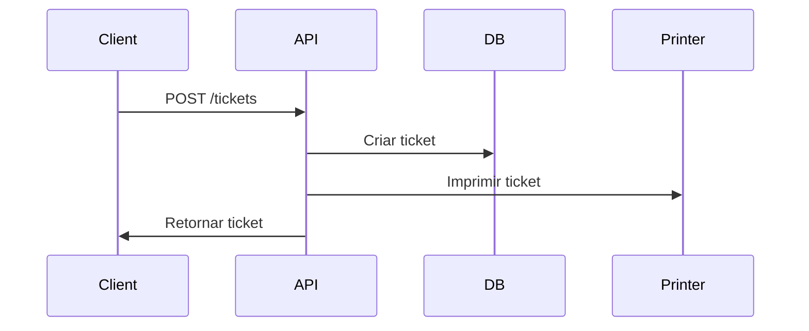
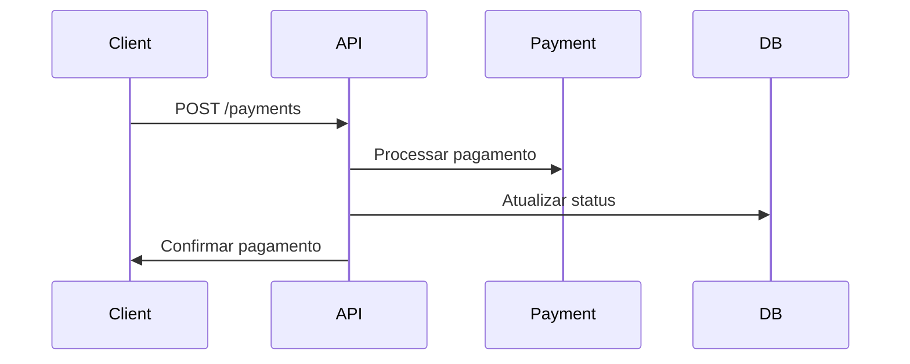
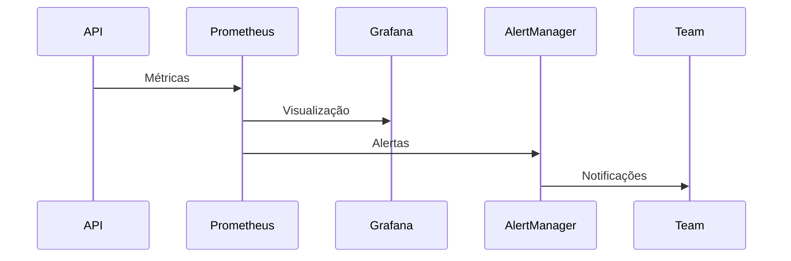

# Arquitetura do Sistema Totem

Este documento descreve a arquitetura do sistema Totem, incluindo seus componentes, interações e decisões de design.

## Visão Geral

O Totem é um sistema de autoatendimento que permite aos usuários realizar pagamentos e acessar serviços de forma autônoma. A arquitetura foi projetada para ser:

- **Escalável**: Suporta múltiplos totens e alta carga
- **Resiliente**: Tolerante a falhas e auto-recuperável
- **Segura**: Proteção de dados e transações
- **Monitorável**: Métricas e logs abrangentes
- **Manutenível**: Código limpo e bem documentado

## Componentes Principais

### 1. API (Backend)

```
apps/api/
├── config/         # Configurações
├── models/         # Modelos de dados
├── routers/        # Endpoints da API
├── services/       # Lógica de negócio
└── tests/          # Testes
```

#### Tecnologias
- FastAPI
- SQLAlchemy
- Pydantic
- OpenTelemetry
- Prometheus

#### Principais Funcionalidades
- Autenticação e autorização
- Gerenciamento de tickets
- Processamento de pagamentos
- Integração com impressoras
- Métricas e monitoramento

### 2. Interface Web (Frontend)

```
apps/web/
├── src/
│   ├── components/  # Componentes React
│   ├── hooks/       # Custom hooks
│   ├── services/    # Serviços de API
│   └── utils/       # Utilitários
├── public/          # Assets estáticos
└── tests/           # Testes
```

#### Tecnologias
- React
- TypeScript
- Material-UI
- Jest
- React Testing Library

#### Principais Funcionalidades
- Interface do usuário
- Gerenciamento de estado
- Comunicação com API
- Validação de formulários
- Testes automatizados

### 3. Banco de Dados

#### Tecnologias
- PostgreSQL
- Alembic (migrations)
- SQLAlchemy (ORM)

#### Principais Tabelas
- users
- tickets
- services
- payments
- printers
- metrics

### 4. Monitoramento

#### Tecnologias
- Prometheus
- Grafana
- AlertManager
- OpenTelemetry

#### Métricas Principais
- Tempo de resposta
- Taxa de erros
- Uso de recursos
- Status dos serviços
- Métricas de negócio

## Fluxos de Dados

### 1. Criação de Ticket



### 2. Processamento de Pagamento



### 3. Monitoramento



## Padrões de Design

### 1. Circuit Breaker

```python
class CircuitBreaker:
    def __init__(self, failure_threshold: int = 5):
        self.failures = 0
        self.threshold = failure_threshold
        
    async def execute(self, func):
        if self.failures >= self.threshold:
            raise CircuitBreakerOpen()
        try:
            return await func()
        except Exception:
            self.failures += 1
            raise
```

### 2. Retry Pattern

```python
class Retry:
    def __init__(self, max_attempts: int = 3):
        self.max_attempts = max_attempts
        
    async def execute(self, func):
        for attempt in range(self.max_attempts):
            try:
                return await func()
            except Exception:
                if attempt == self.max_attempts - 1:
                    raise
                await asyncio.sleep(2 ** attempt)
```

### 3. Repository Pattern

```python
class Repository:
    def __init__(self, model: Type[Base]):
        self.model = model
        
    async def get(self, id: int) -> Optional[Base]:
        return await db.query(self.model).get(id)
        
    async def create(self, data: dict) -> Base:
        instance = self.model(**data)
        db.add(instance)
        await db.commit()
        return instance
```

## Segurança

### 1. Autenticação

- JWT tokens
- Refresh tokens
- Rate limiting
- CORS configurado

### 2. Autorização

- RBAC (Role-Based Access Control)
- Permissões granulares
- Validação de escopo

### 3. Dados

- Criptografia em trânsito (TLS)
- Criptografia em repouso
- Sanitização de inputs
- Validação de dados

## Escalabilidade

### 1. Horizontal

- Múltiplas instâncias da API
- Load balancing
- Sharding de banco de dados
- Cache distribuído

### 2. Vertical

- Otimização de queries
- Índices apropriados
- Caching
- Async/await

## Resiliência

### 1. Falhas

- Circuit breakers
- Retry patterns
- Timeouts
- Fallbacks

### 2. Recuperação

- Logs detalhados
- Métricas de erro
- Alertas proativos
- Backup automático

## Monitoramento

### 1. Métricas

- Tempo de resposta
- Taxa de erros
- Uso de recursos
- Métricas de negócio

### 2. Logs

- Estruturados (JSON)
- Níveis apropriados
- Contexto rico
- Rotação automática

### 3. Alertas

- Thresholds configuráveis
- Notificações
- Escalonamento
- Runbooks

## Manutenção

### 1. Código

- Padrões consistentes
- Documentação clara
- Testes automatizados
- Code review

### 2. Infraestrutura

- IaC (Infrastructure as Code)
- CI/CD
- Backup automático
- Monitoramento proativo

## Considerações Futuras

### 1. Escalabilidade

- Kubernetes
- Service mesh
- Cache distribuído
- Message queue

### 2. Funcionalidades

- Pagamentos PIX
- Biometria
- NFC
- QR Code

### 3. Integrações

- Mais processadores de pagamento
- Sistemas de gestão
- APIs externas
- Serviços de notificação 